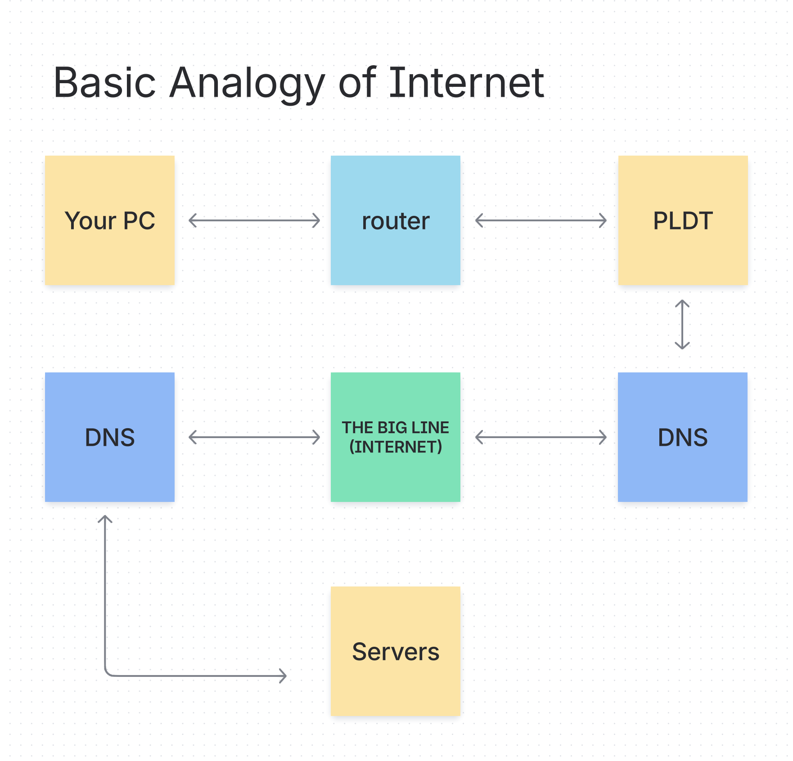

# 🌐 Welcome to Frontend Road 🚀
_A beginner-friendly frontend development guide for people stupid like me_

Reference: [roadmap.sh/frontend](https://roadmap.sh/frontend)  

---

## 🎯 Objective  
This is my personal journey in understanding the basics of frontend development — explained in simple words and with relatable analogies.  

---

## 📖 Topics  

1 How does the Internet Work?

---

2️ What is HTTP?

**HTTP** → **HyperText Transfer Protocol**  
It’s a way for the client (your browser) and the server (where a website lives) to talk to each other over the internet.

---

3 What is DNS?

**DNS** → **Domain Name System**  
The internet’s phonebook. It translates human-friendly website names (like `google.com`) into machine-friendly IP addresses (like `142.250.190.78`).  

**Analogy:**  
Think of it like a game username + tag combo:  
- **Username** → what other players see  
- **Tag** → the unique ID just for you  

---

4 What is Hosting?

There are 3 main types of hosting:  

| Hosting Type         | Analogy                     | Pros                                           | Cons                                             |
|----------------------|-----------------------------|------------------------------------------------|--------------------------------------------------|
| **Shared Hosting**   | 🏢 Apartment with roommates  | Cheapest, easy setup for small sites           | Limited resources, can be slow                   |
| **VPS Hosting**      | 🏙 Condo in a big building   | Guaranteed resources, more control             | Costs more, may waste unused resources           |
| **Dedicated Hosting**| 🏠 Your own house            | Full control, all resources are yours          | Very expensive                                   |

---

5 Browsers and How They Work

🎥 Watch this video for a great explanation → *[How Web Browsers Work](https://www.youtube.com/watch?v=EoYkl8rwbiM)*

---

## 📚 Topic List  
- [ ] HTML  
- [ ] CSS  
- [ ] JavaScript  

---

💡 _Note: This README will keep evolving as I learn more._
